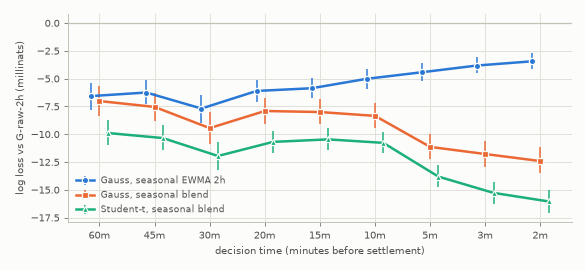
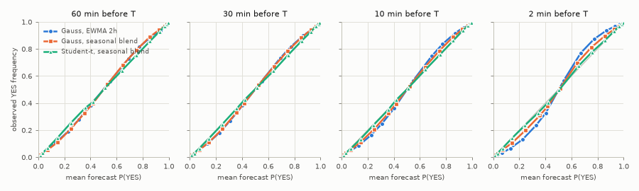
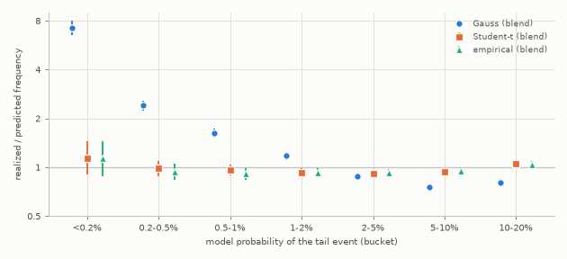
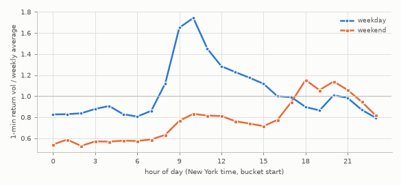

# 01 — Fair-value calibration on real BTC paths

Status: **results on real data** (Bitstamp BTC/USD 1-minute bars, test period 2025-01-01 to
2026-09-25, validation year 2024). No Kalshi prices were available, so nothing here measures
market mispricing; it measures how well each fair-value model predicts the settlement.
Code: `dh/research/fv_study/` (single entry point `python -m dh.research.fv_study.run`).
Model math: `docs/MODELS_fairvalue.md`. Tables: `docs/research/tables/fv_*.csv`.

## Summary

All intervals are 95% day-block bootstrap intervals (1,000 resamples), paired across models.
"mn" = millinats of log loss per contract. Test period unless stated.

1. **Best model: seasonal volatility blend plus a Student-t tail.** Log loss 0.2530 vs 0.2651
   for the naive Gaussian with a 2-hour EWMA volatility: **-12.1 mn [-12.8, -11.4]**; Brier
   **-0.0022 [-0.0023, -0.0021]**. The same ranking holds on the validation year (-11.0 mn
   [-11.8, -10.2]) and on the Kalshi-like $250 strike grid (-10.7 mn [-11.7, -9.8]).
   The gain decomposes additively:
   * a better volatility forecast, -9.3 mn [-10.1, -8.5]: the horizon-specific QLIKE blend
     of EWMA half-lives (-7.4 mn) plus the intraday/weekly seasonal profile (-1.9 mn; with the
     fat tail in place -1.5 mn [-1.8, -1.2], validation -1.2 mn);
   * the fat tail, **-2.85 mn [-3.11, -2.61]** against the same volatility with Gaussian tails.
   The lognormal vol-mixture and the empirical-residual tails are statistically tied with the
   Student-t (within 0.12 mn).
2. **Calibration.** Student-t on the blend has an expected calibration error of 0.2-0.5 cents
   at every decision time; the Gaussian on the same volatility 1.4-1.7 cents; the naive
   Gaussian 1.6-3.8 cents. The Brier reliability term falls from 5.1e-4 (Gauss blend) to
   1e-5.
3. **Tails (hypothesis H2).** With a *well-calibrated volatility*, Gaussian tail
   probabilities are still wrong by large factors. Realized/predicted frequency of the tail
   event, by Gaussian probability bucket: <0.2%: **7.2x [6.5, 8.0]**; 0.2-0.5%: 2.4x
   [2.2, 2.6]; 0.5-1%: **1.63x [1.53, 1.73]**; 1-2%: 1.17x [1.11, 1.24]; 2-5%: **0.88x
   [0.84, 0.92]**; 5-10%: 0.76x [0.72, 0.79]. The Student-t model's ratios are 0.92-1.14
   in every bucket. Up and down tails are symmetric within their intervals.
4. **Fair price of a strike 2.0 sd away** (sd = the calibrated volatility forecast): realized
   frequency **2.27% [2.11, 2.44] at 60 minutes, 2.37% [2.21, 2.55] at 30, 2.19% [2.03, 2.36]
   at 10**, both sides pooled. Two sd is where the fat-tailed and Gaussian curves cross
   (Gaussian 2.28%), so the Gaussian is roughly right there by coincidence. It overprices
   strikes closer in (at 1.5 sd, 5.0-5.3% realized vs 6.7%) and badly underprices strikes
   further out (at 3 sd, 0.52-0.68% realized vs 0.13%).
5. **Volatility.** Short half-lives beat long ones (the 1-day EWMA is worst, +22 mn). The best
   blend weights depend on the horizon: at 2-5 minutes about 55% on the 10-minute EWMA, at
   60 minutes about 35% each on the 2-hour and 1-day EWMAs. The seasonal profile is stable
   (correlation 0.97 between the 2024 and 2025-26 fits). Weekday volatility peaks at 1.7-2.0x
   the weekly average around the 09:30 New York equity open. Weekends run at 0.55-0.8x, except
   Saturday/Sunday evenings New York time.
6. **Short-horizon predictability is not worth modelling.** One-minute returns had a
   lag-1 autocorrelation of +0.031 in 2025-26 (t = 23) but only +0.004 in 2024. The effect
   on an at-the-money contract is at most 1.2 cents for a 1-minute horizon and 0.5 cents at
   5 minutes. At the contract's own decision times no signal survives: a walk-forward
   momentum drift changes fair values by 0.06-0.34 cents on average but does not improve
   out-of-sample log loss at any decision time in the test period. Use `drift_abs = 0`.
7. **Greeks at current conditions** (spot $84,541, blend volatility 32.5% annualized):
   at-the-money hedge notional per YES contract is $116 at 60 minutes, $292 at 10, $769 at 2
   and $1,543 when the window opens. Ignoring the 60-print averaging (pricing the print at
   `T`) misprices a 1-sd strike by **4.8 cents at 2 minutes and 12 cents at the window open**
   (relevant to H4).

Recommended production configuration: section 11.

## 1. Questions

Q1. Which fair-value model (volatility estimator x tail model) predicts KXBTCD-style
threshold outcomes best out of sample, by decision time and regime? Q2. How good are tail
probabilities 1.5-3.5 sd away, and what should a 2-sd strike cost? Q3. How much does
volatility seasonality buy? Q4. Do past 1-5 minute returns predict what comes next enough
to matter against a 1-cent tick? Q5. What delta and gamma does the strategy carry?

## 2. Data

Bitstamp BTC/USD 1-minute OHLCV from the public `ff137/bitstamp-btcusd-minute-data`
dataset: the 2012-2025 bulk file (used from 2022-12-01, for warm-up and training) joined with
the 2025-01-07 to 2026-09-25 file (the later file wins on overlap). The grid is regular
(missing minutes were filled upstream with flat zero-volume candles). Candles are labelled by
open time.

Hygiene, applied identically to every model:

* A zero-volume flat candle is a minute without a trade. Runs of 5 or more such minutes are
  treated as feed outages (753 minutes in 2024, 236 in 2025-26).
* An hour `T` is excluded if an outage minute lies between the earliest spot candle
  (`T - 61 min`) and the settlement candle, or if the settlement minute `[T-60s, T)` itself
  had no trade (the proxy would be a stale price).

| period | hours | used | excluded: outage | excluded: no trade in settlement minute | median trailing vol, used / excluded |
|---|---|---|---|---|---|
| validation 2024 | 8,784 | 8,382 | 68 | 334 | 48% / 42% |
| test 2025-01-01 .. 2026-09-25 | 15,168 | 15,005 | 16 | 147 | 38% / 38% |

Excluded hours are quieter than average in 2024 (no-trade minutes happen in quiet markets) and
indistinguishable in the test period. Including the no-trade hours changes no conclusion
(section 10).

## 3. The settlement proxy: what it can and cannot tell us

The contract settles on the mean of 60 one-second BRTI prints in `(T-60s, T]`; the study
uses `A_T = OHLC4` of the Bitstamp candle `[T-60s, T)`. A simulation (Brownian path on a
0.1-second grid; BRTI = the path at whole seconds; Bitstamp trades = Poisson arrivals with
bid-ask bounce; `dh/research/fv_study/proxy.py`, `tables/fv_proxy_error.csv`) gives, in units
of the one-minute standard deviation:

| trades per second | sd(OHLC4 - true average) | corr of proxy and true moves since the previous close | kappa (proxy) | kappa (true average) |
|---|---|---|---|---|
| 0.1 | 0.20 | 0.96 | 0.50 | 0.51 |
| 0.3 | 0.17 | 0.96 | 0.34 | 0.40 |
| 1.0 | 0.18 | 0.96 | 0.29 | 0.36 |

The proxy error is therefore about 15% of the outcome's standard deviation at 2 minutes, 6% at
10 minutes and 2% at 60 minutes. Results at 2-5 minutes are statements about the proxy. The
final-minute window arithmetic of the production model is validated by Monte Carlo in the
unit tests, not by this data.

Proxy variance time. Relative to the spot at `t` (the close of the candle ending at `t`),
`A_T - spot` is `tau - 1` close-to-close minute returns plus the proxy term, so its variance
time in close-to-close units is

    v_eff(tau) = (tau - 1) * 60 s + kappa * 60 s,   kappa = E[(OHLC4 - C_prev)^2] / E[(C - C_prev)^2]

`kappa` is estimated every month on the training window (0.38-0.41 in the validation year,
0.30-0.39 in the test period). The Brownian value is 0.26 for a continuously traded path and
0.34 for the true 60-print average; sparse trading (0.1-0.3 trades per second reproduces the
empirical values) pushes the effective origin of the path back in time. All models share the
same `v_eff`, so it does not affect the comparison; the production pricer uses the exact
window formula (`tau_first + 19.5 s`).

## 4. Methodology and leakage controls

**Timing.** Settlement times `T` are every top of the hour. Decision times are
`t = T - tau`, `tau` in {60, 45, 30, 20, 15, 10, 5, 3, 2} minutes. `spot(t)` is the close of the
candle `[t-60s, t)`, the last trade before `t`. The candle that *starts* at `t` is never used;
a placebo that uses it (section 10) shows how much a one-minute look-ahead would flatter the
results. Volatility features at `t` are EWMA values after folding in the return of the spot
candle. `tests/models/test_fv_study_smoke.py` asserts these timing invariants.

**Walk-forward.** Calendar months, never shuffled. For evaluation month `[m, m+1)` every
fitted quantity uses only minutes before `m` and hours with `T <= m` in the trailing 12 months:
`kappa`, the seasonal profile, the QLIKE blend weights (per decision time), the Student-t
`(c, nu)`, the vol-mixture `(c, cv)` and the empirical residual distribution. EWMAs are causal.
Design choices (seasonal layout) were made on the **validation** year (2024, trained on 2023).
The **test** period, 2025-01-01 to 2026-09-25 (15,005 hours), is out of sample for every
parameter; for the final model choice see limitation 5.

**Strikes.** Every model is scored on the same contracts: `greater` thresholds placed with a
parameter-free reference sd (raw 2-hour EWMA, fixed `kappa = 0.35`).
(i) Normalized grid `K = spot + z * sd_ref`, `z` in [-3, 3] in steps of 0.25: 25 strikes x
9 decision times x 15,005 hours = 3.38 million contracts.
(ii) Kalshi-like grid: every multiple of $250 within `spot +/- 4 sd_ref` (0.82 million).
(iii) For tails, `|z|` in [1.5, 3.5] in steps of 0.25 on both sides.

**Models.** All are priced with `dh.models.fairvalue.digital_vec`, with the full window still
ahead.

| name | volatility | tail |
|---|---|---|
| `G-raw-{10m,30m,2h,6h,1d}` | EWMA of 1-minute squared log returns, half-life as named | Gauss |
| `G-seas-{...}` | the same EWMA on deseasonalized returns, times the mean seasonal factor over `[t, T]` | Gauss |
| `G-blend-raw` | QLIKE-weighted blend of the five raw EWMAs, weights per decision time | Gauss |
| `G-blend` | QLIKE-weighted blend of the five seasonal EWMAs, weights per decision time | Gauss |
| `T-raw-2h` | raw 2h EWMA | Student-t, `(c, nu)` by maximum likelihood per decision time |
| `T-blend` | `G-blend` volatility | Student-t, `(c, nu)` by maximum likelihood per decision time |
| `MIX-blend` | `G-blend` volatility | lognormal vol mixture, `(c, cv)` by maximum likelihood |
| `EMP-blend` | `G-blend` volatility | kernel-smoothed empirical distribution of training residuals (the "bootstrap" reference) |

**Scores.** Brier score and log loss (p clipped to [1e-6, 1-1e-6]) per contract, averaged over
hours, decision times and strikes. The average Brier score over the `z` grid approximates the
CRPS of the predictive distribution in standardized units. Calibration is measured with the
Murphy decomposition (reliability / resolution / uncertainty, 20 bins), the ECE, reliability
tables and calibration-in-the-large. **Confidence intervals** use a day-block bootstrap: 1,000
resamples of calendar days, so all 225 contracts of a day move together. They are paired across
models (same resampled days), so model differences get their own intervals. Week- and
month-block intervals are reported as a sensitivity check.

## 5. Q1: model comparison

Test period, normalized grid (`tables/fv_q1_scores.csv` has every model, grid, period and
breakdown):

| model | Brier | log loss | log loss vs G-raw-2h (mn) |
|---|---|---|---|
| **T-blend** | **0.07675** | **0.25296** | **-12.14 [-12.83, -11.44]** |
| EMP-blend | 0.07678 | 0.25305 | -12.05 [-12.75, -11.34] |
| MIX-blend | 0.07676 | 0.25308 | -12.02 [-12.71, -11.32] |
| G-blend | 0.07726 | 0.25581 | -9.29 [-10.06, -8.48] |
| G-blend-raw | 0.07761 | 0.25771 | -7.39 [-7.98, -6.73] |
| G-seas-30m | 0.07763 | 0.25892 | -6.18 [-7.03, -5.23] |
| T-raw-2h | 0.07765 | 0.25925 | -5.85 [-6.15, -5.54] |
| G-seas-2h | 0.07806 | 0.25964 | -5.47 [-6.18, -4.77] |
| G-raw-30m | 0.07788 | 0.26053 | -4.58 [-5.24, -3.84] |
| G-seas-10m | 0.07763 | 0.26219 | -2.92 [-4.05, -1.67] |
| G-seas-6h | 0.07870 | 0.26299 | -2.12 [-3.01, -1.23] |
| G-raw-10m | 0.07776 | 0.26304 | -2.07 [-3.12, -0.87] |
| G-raw-2h | 0.07896 | 0.26511 | 0 |
| G-seas-1d | 0.07977 | 0.26858 | +3.48 [+2.12, +4.78] |
| G-raw-6h | 0.08086 | 0.27491 | +9.81 [+8.80, +10.76] |
| G-raw-1d | 0.08375 | 0.28728 | +22.18 [+19.86, +24.42] |

Paired against `G-blend` (same volatility, Gaussian tails): T-blend -2.85 mn [-3.11, -2.61],
MIX-blend -2.73 [-2.98, -2.49], EMP-blend -2.76 [-3.02, -2.51]; Brier -5.1e-4 [-5.6, -4.6].

**Why each ingredient helps** (Murphy decomposition, test, normalized grid): the fat tail
fixes *calibration* (reliability term 5.1e-4 for G-blend and 1e-5 for T-blend and T-raw-2h).
The blend and the seasonal profile add *resolution* (0.17311 for T-blend vs 0.17223 for
T-raw-2h): a sharper, better-timed volatility forecast. The single short EWMAs (10m) have good
sharpness but are noisy at long horizons, while the long ones (6h, 1d) are miscalibrated
because they lag volatility regimes and intraday seasonality.

By decision time (log loss; difference vs G-raw-2h in mn):

| model | 60m | 45m | 30m | 20m | 15m | 10m | 5m | 3m | 2m |
|---|---|---|---|---|---|---|---|---|---|
| G-raw-2h | 0.2922 | 0.2872 | 0.2863 | 0.2702 | 0.2673 | 0.2615 | 0.2457 | 0.2395 | 0.2360 |
| G-seas-2h | -6.6 | -6.3 | -7.7 | -6.1 | -5.9 | -5.0 | -4.4 | -3.8 | -3.4 |
| G-blend | -7.0 | -7.5 | -9.5 | -7.9 | -8.0 | -8.4 | -11.1 | -11.8 | -12.4 |
| T-blend | **-9.9** | **-10.3** | **-12.0** | **-10.7** | **-10.5** | **-10.8** | **-13.8** | **-15.3** | **-16.0** |

(each T-blend entry has a CI of about +/-1 mn; see `fv_logloss_by_tau.png`). ECE of T-blend
by decision time is 0.21-0.52 cents, of G-blend 1.41-1.71 cents.





The reliability diagrams show the naive Gaussian (2-hour EWMA) is *underconfident* at short
horizons: observed frequencies are more extreme than its forecasts at 2-10 minutes. Its
variance level is too high there, and the QLIKE blend puts a total weight of only 0.7-0.8 on
the EWMAs at 2-5 minutes. The blend fixes the level; the Student-t fixes the shape.

**By regime** (T-blend minus G-raw-2h, mn, test):

| split | levels (difference [CI]) |
|---|---|
| distance \|z\| | 0-0.5: -4.0 [-4.3, -3.7]; 0.5-1: -18.9 [-20.1, -17.9]; 1-1.5: -21.1 [-22.2, -20.1]; 1.5-2: -12.6 [-13.4, -11.7]; 2-2.5: -7.7 [-8.5, -6.8]; 2.5-3: -8.3 [-9.4, -7.2] |
| trailing-vol tercile | low -11.6 [-12.7, -10.5]; mid -12.2 [-13.3, -11.0]; high -12.6 [-13.8, -11.4] |
| trend (\|6h return\| / 6h sd) | chop <0.5: -11.7 [-12.6, -10.8]; mid: -12.8 [-13.8, -11.8]; trend >1.5: -11.7 [-13.5, -10.0] |
| day | weekday -12.8 [-13.6, -12.0]; weekend -10.5 [-11.7, -9.3] |
| vol burst (top 10% of 10m/1d vol ratio, ex ante) | burst -16.6 [-19.1, -14.1] (log loss 0.331); normal -11.6 [-12.2, -10.9] (0.243) |
| FOMC reaction hour (15:00 ET, 14 hours) | -28.0 [-61.1, -1.5] (log loss 0.466 vs 0.253 elsewhere) |
| ex-post big move (\|A - spot(60m)\| > 3 sd_ref; descriptive only) | -121.7 [-136.6, -106.9] (log loss 0.713) |

The ordering fat-tailed blend > Gaussian blend > single EWMA holds in every ex-ante regime.
In the 14 FOMC hours and the ex-post big-move hours the three fat-tailed variants and the
Gaussian blend are within noise of each other (vol mixture best on big moves, 0.707 vs 0.713).
The gains are largest on the shoulders (0.5-1.5 sd), where a Gaussian with the correct
variance puts too much probability, and in volatility bursts. Event hours are hard for every model: log loss in FOMC reaction hours is
nearly double the average and no model anticipates the event (no calendar input). Weekends
gain less from seasonality (G-seas-2h -1.8 mn on weekends vs -6.9 on weekdays).

On the Kalshi-like $250 grid the ordering is identical: T-blend -10.7 mn [-11.7, -9.8] vs
G-raw-2h, G-blend -7.6 [-8.6, -6.7].

## 6. Q2: tail calibration

Tail event: `A > K` for strikes above spot, `A <= K` below. Contracts 1.5-3.5 reference sd
away, grouped by the model's own probability of the tail event (test period; ratio =
realized / predicted; `tables/fv_q2_tail_calibration.csv`):

| model p bucket | contracts (by model) | Gauss (blend vol): realized | ratio | Student-t (blend vol): realized | ratio | empirical: ratio |
|---|---|---|---|---|---|---|
| <0.2% | 0.4-1.1M | 0.30% | **7.2 [6.5, 8.0]** | 0.13% | 1.14 [0.91, 1.44] | 1.13 [0.88, 1.44] |
| 0.2-0.5% | 0.27-0.49M | 0.80% | **2.40 [2.22, 2.58]** | 0.33% | 0.98 [0.88, 1.09] | 0.94 [0.84, 1.05] |
| 0.5-1% | 0.23-0.46M | 1.18% | **1.63 [1.53, 1.73]** | 0.69% | 0.96 [0.89, 1.03] | 0.91 [0.84, 0.99] |
| 1-2% | 0.25-0.45M | 1.70% | 1.17 [1.11, 1.24] | 1.34% | 0.93 [0.88, 0.99] | 0.93 [0.87, 0.99] |
| 2-5% | 0.35-0.48M | 2.86% | **0.88 [0.84, 0.92]** | 2.90% | 0.92 [0.88, 0.96] | 0.93 [0.89, 0.97] |
| 5-10% | 0.16-0.19M | 5.26% | **0.76 [0.72, 0.79]** | 6.35% | 0.94 [0.90, 0.98] | 0.95 [0.91, 0.99] |
| 10-20% | 0.04-0.07M | 10.6% | 0.80 [0.77, 0.84] | 13.5% | 1.05 [0.99, 1.11] | 1.04 [0.99, 1.09] |



* The pattern is the textbook fat-tail signature: a Gaussian with the *right variance* puts
  too much mass on the shoulders (overprices 2-10% events by 12-24%) and far too little in the
  tails (underprices sub-1% events by 1.6-7x). The validation year shows the same pattern
  (Gauss: <0.2% 8.1x, 0.5-1% 1.57x, 5-10% 0.74x; Student-t 0.91-1.25).
* The Student-t is calibrated within about 8% in every bucket except the sparse <0.2% one
  (1.14, interval includes 1). It is slightly too wide at 2-5 minutes (ratios 0.86-0.91 for
  0.5-5% events: the short-horizon proxy is smoother than a t-distribution) and slightly too
  thin in the far tail at 30-60 minutes (ratio 1.5 [1.0, 2.1] below 0.2%).
* Up and down tails are symmetric within their intervals (for example Gauss 0.5-1%: 1.63
  up, 1.62 down; Student-t 2-5%: 0.91 up, 0.92 down). No skew adjustment is warranted.

**Fair price of a strike z sd away** (sd = the model's own calibrated forecast; realized
frequency of the tail event, both sides pooled, test; `tables/fv_q2_fair_price_at_z.csv`):

| z | Gauss price | Student-t model | realized 60m | realized 30m | realized 10m | realized 2m |
|---|---|---|---|---|---|---|
| 1.0 | 15.87c | 12.1-13.0c | 11.93 [11.56, 12.29] | 12.40 [12.03, 12.73] | 12.18 [11.84, 12.53] | 11.51 [11.15, 11.88] |
| 1.5 | 6.68c | 5.3-5.7c | 5.17 [4.92, 5.43] | 5.25 [4.99, 5.52] | 5.05 [4.81, 5.33] | 5.01 [4.77, 5.27] |
| **2.0** | **2.28c** | 2.42-2.48c | **2.27 [2.11, 2.44]** | **2.37 [2.21, 2.55]** | **2.19 [2.03, 2.36]** | 2.29 [2.13, 2.47] |
| 2.5 | 0.62c | 1.13-1.19c | 1.19 [1.07, 1.31] | 1.19 [1.07, 1.30] | 1.02 [0.90, 1.12] | 1.08 [0.96, 1.21] |
| 3.0 | 0.13c | 0.55-0.63c | 0.68 [0.59, 0.78] | 0.60 [0.52, 0.69] | 0.52 [0.45, 0.60] | 0.57 [0.49, 0.66] |
| 3.5 | 0.02c | 0.28-0.35c | 0.43 [0.36, 0.50] | 0.34 [0.28, 0.40] | 0.28 [0.22, 0.34] | 0.27 [0.22, 0.34] |

The validation year gives 2.33%, 2.18% and 2.34% at 60/30/10 minutes for the 2-sd strike.
**A 2.0-sd strike is worth about 2.2-2.4 cents at every horizon from 10 to 60 minutes.**
What changes the economics for H2 is the far tail. A 3-sd longshot is worth 0.5-0.7 cents,
not the Gaussian 0.13 cents, and a 3.5-sd one 0.3-0.4 cents, not 0.02. Selling 1-cent YES at
3 sd therefore earns about 0.3-0.5 cents of expected value before fees and capital cost, not
the 0.9 cents a Gaussian model suggests. At 2.5 sd a 1-cent price has no edge left. Whether
Kalshi longshots trade above these fair values is Experiment 0's question.

## 7. Q3: volatility seasonality



Profile of 1-minute return volatility (normalized by a slow trailing volatility level;
weekly mean of the squared factor = 1), test period, New York time
(`tables/fv_q3_seasonal_profile.csv`). Weekdays sit at 0.8-0.9x overnight, rise in the
08:00 hour (US data releases at 08:30, 1.12x), peak in the 09:00 and 10:00 hours (1.65x and
1.74x; the half-hour profile peaks at 2.0x at 09:30, the equity open), decline through the
afternoon, with a bump at 20:00 (1.0x). Weekends run at 0.53-0.83x until the evening
(1.05-1.15x from 18:00 New York time; the pooled weekend profile does not separate Saturday
from Sunday, when CME futures reopen). The 2024 and 2025-26 profiles have correlation 0.97. In UTC the equity-open peak is smeared over two
buckets by daylight-saving shifts (1.73x at 14:00 UTC vs 1.46x at 13:00); New York time
removes that blur.

Out-of-sample value (paired against a flat profile, same model and strikes;
`tables/fv_q3_layouts.csv`):

| profile | T-blend, validation (mn) | T-blend, test (mn) | G-blend, test (mn, vs flat) |
|---|---|---|---|
| time of day (UTC, hourly) | -0.63 [-0.80, -0.45] | -0.77 [-0.95, -0.59] | -1.07 |
| weekday/weekend x hour (UTC) | -1.09 [-1.36, -0.84] | -1.15 [-1.37, -0.93] | -1.59 |
| weekday/weekend x half-hour (New York) | -1.14 [-1.44, -0.83] | -1.33 [-1.60, -1.05] | -1.56 |
| hour of week (UTC) | -1.05 [-1.33, -0.74] | -1.33 [-1.58, -1.07] | -1.83 |
| **hour of week x half-hour (New York)**: chosen on validation | **-1.19 [-1.51, -0.83]** | **-1.54 [-1.84, -1.22]** | -1.90 |

Seasonality is worth about 1.2-1.5 mn of log loss when a fat tail and a blend are already in
place (about half of what the fat tail buys). Its benefit for single EWMAs is larger: the
seasonal 2-hour EWMA beats the raw one by 3.4 mn at 2 minutes and by 7.7 mn at 30 minutes. A
weekday/weekend x time-of-day profile captures most of it. The finer hour-of-week x half-hour
New York profile was the validation winner and repeats on the test period.

## 8. Q4: short-horizon predictability

Minute level (`tables/fv_q4_minute.csv`): standardized 1-minute returns, overlapping windows,
Newey-West errors.

| past window -> future window | 2024: slope (t) | 2025-26: slope (t) | ATM effect of a 1-sd past move, 2025-26 |
|---|---|---|---|
| 1m -> 1m | 0.004 (2.5) | 0.031 (22.7) | 1.24c |
| 1m -> 5m | -0.000 (-0.3) | 0.013 (9.1) | 0.50c |
| 1m -> 10m | -0.004 (-2.3) | 0.006 (4.8) | 0.26c |
| 5m -> 5m | -0.004 (-1.4) | -0.002 (-0.8) | -0.07c |
| 5m -> 30m | -0.001 (-0.3) | -0.005 (-2.2) | -0.21c |

R^2 is at most 0.1%. The 2025-26 lag-one momentum is most likely a Bitstamp artefact: with
fewer trades, its last-trade price catches up with the leading venues over the next minute.
It is absent in 2024 and should be weaker or absent in BRTI, which is a composite. At the
contract's decision times (`tables/fv_q4_decision.csv`), 4 of 36 horizon x look-back
combinations have an interval excluding zero in 2025-26 (12 of 36 in 2024), with signs that
flip between years. The largest effect is 1.1 cents at the money for a 1-sd past move.
Finally, a momentum drift fitted walk-forward and added to the T-blend fair value
(`tables/fv_q4_drift_oos.csv`) moves prices by 0.06-0.34 cents on average and changes
out-of-sample log loss by -0.06 to +0.13 x 1e-3 nats. In the test period no decision time /
look-back combination improves significantly (2 of 27 get worse); in 2024, 2 improve by about
0.1 mn and 5 get worse. **No drift term.** Speed on external moves (H3) is the lead-lag
between venues and the index; it belongs in the nowcast, not in a drift.

## 9. Q5: delta and gamma the strategy carries

Spot $84,541 and the current blend volatility (32.5% annualized; `tables/fv_q5_greeks.csv`
also has 35% and 60%). A `greater` contract whose strike is `z` standard deviations of the
settlement average away from where the average is heading; before the window no print is
fixed, inside it `k` prints are fixed at spot. Hedge notional = `|delta| * spot` per YES
contract ($1 payout; x100 for 100 contracts). "Delta change per 1 sd" = `gamma * sd_R`, the
change in BTC hedge per contract when spot moves by one sd of the remaining average.

| state | sd of the average | notional z=0 | z=0.5 | z=1 | z=2 | delta change per 1 sd at z=1 (BTC) |
|---|---|---|---|---|---|---|
| 60 min before T | $292 | $116 | $102 | $70 | $16 | 0.0008 |
| 30 min | $205 | $164 | $145 | $100 | $22 | 0.0012 |
| 10 min | $116 | $292 | $257 | $177 | $39 | 0.0021 |
| 5 min | $79 | $428 | $377 | $259 | $58 | 0.0031 |
| 2 min | $44 | $769 | $679 | $467 | $104 | 0.0055 |
| window opens (k = 0) | $22 | $1,543 | $1,362 | $936 | $209 | 0.011 |
| k = 30 prints fixed | $7.7 | $2,182 | $1,926 | $1,323 | $295 | 0.016 |
| k = 55 prints fixed | $0.53 | $5,293 | $4,671 | $3,210 | $716 | 0.038 |

These are Gaussian greeks. The calibrated Student-t (`nu = 4.4`) puts more delta at the money
and less on the shoulders: at 60 minutes $148 / $113 / $58 / $10 at z = 0 / 0.5 / 1 / 2 (Gauss
$116 / $102 / $70 / $16); at 2 minutes $985 / $754 / $384 / $70. A book hedged with Gaussian
deltas is under-hedged near the money and over-hedged in the wings. Inside the window the
average's own sd collapses faster than the remaining prints' (`sd_avg = (m/60) sd_R`), so
delta per contract keeps growing as prints fix even though each remaining print weighs less.

Why the averaging window matters (H4). Pricing the print at `T` instead of the 60-print
average (variance time `tau` instead of `tau_first + 19.5 s`), for a strike 1 sd (exact) out
of the money (`tables/fv_q5_window_vs_naive.csv`):

| time to T | variance time exact / naive | exact P | naive P | naive error | naive ATM delta understated by |
|---|---|---|---|---|---|
| 60 min | 3,560 s / 3,600 s | 15.87c | 16.00c | +0.13c | 0.6% |
| 10 min | 560 s / 600 s | 15.87c | 16.69c | +0.82c | 3.4% |
| 5 min | 260 s / 300 s | 15.87c | 17.57c | +1.71c | 7% |
| 2 min | 80.5 s / 120 s | 15.87c | 20.64c | +4.77c | 18% (ratio 1.22) |
| 60 s (window opens) | 20.5 s / 60 s | 15.87c | 27.94c | +12.1c | 42% (ratio 1.71) |

A pricer that ignores the averaging is several ticks wrong on every near-money strike in the
last five minutes; whether any Kalshi participant still prices that way is an empirical
question for the collected order books.

## 10. Robustness and adversarial checks

Test period, normalized grid (`tables/fv_robustness.csv`); T-blend minus G-blend unless
stated:

| check | result |
|---|---|
| day / week / 30-day block bootstrap | -2.85 mn with CI [-3.11, -2.61] / [-3.13, -2.60] / [-3.21, -2.42]: dependence across days is weak, CIs barely widen |
| include hours whose settlement minute had no trade | -2.82 [-3.08, -2.59]; T-blend log loss 0.2525 vs 0.2530 |
| training window 6 / 12 / 24 months | T-blend log loss 0.25340 / 0.25296 / 0.25303; tail gain -3.10 / -2.85 / -2.86 mn |
| **look-ahead placebo**: spot and features from the candle starting at `t` (one minute of future data) | log loss falls from 0.2530 to 0.2264, at 2 minutes from 0.220 to 0.113. A one-minute timing slip would have manufactured a 26-mn "improvement", twice the entire real model gain. The ranking is unchanged (-2.87). |
| validation year, same code | identical ordering; T-blend -11.0 mn [-11.8, -10.2] vs G-raw-2h |
| up vs down tails | symmetric within CIs (section 6) |

Overlapping samples: the 225 contracts of a day share one day's price path, and neighbouring
hours share volatility. Treating contracts as independent would make the intervals 3x too
narrow for model differences (T-blend vs G-blend: +/-0.09 mn instead of +/-0.26 mn) and 4.5x
too narrow for log-loss levels. All reported intervals resample whole days, and the
week/month-block check shows longer-range dependence adds little.

## 11. Recommended production fair-value configuration

Generated as `dh/models/data/fv_recommended.json`, loaded by
`dh.models.fvmodel.FairValueModel.from_config(load_recommended_config())`. The blend weights
and tail parameters are the walk-forward fit used for September 2026 (trained on
2025-09-01 to 2026-09-01); the seasonal profile uses the 365 days to 2026-09-25.

* **Volatility:** `VolForecaster` over the BRTI nowcast, returns sampled at >= 60 s
  (`min_dt_s = 60`, the resolution validated here), outage returns > 600 s dropped.
  Deseasonalized EWMAs with half-lives 10 min, 30 min, 2 h, 6 h and 1 day, blended with
  QLIKE weights that depend on the horizon (knots at 2 to 60 minutes, interpolated linearly;
  current fit: at 2 min 0.50 x 10m + 0.03 x 2h + 0.16 x 1d, at 60 min 0.27 x 10m +
  0.45 x 2h + 0.08 x 6h + 0.29 x 1d). Multiply by the mean seasonal factor over
  `[now, T]`.
* **Seasonal profile:** hour of week x 30-minute buckets in New York time, fitted on the
  trailing 12 months (normalized by a 3-day trailing volatility level, squared returns
  winsorized at 6x the pooled RMS).
* **Tail:** Student-t, `nu` by horizon (currently 4.0 at 2-3 min, 4.4-4.7 at 5-60 min;
  3.8-6.5 over the test period), scale `c = 1.00` (0.98-1.02). The vol mixture (`cv` about 0.4)
  or the empirical tail are equivalent alternatives; the Gaussian is not.
* **Window:** exact 60-print window state from `SettlementTracker`
  (`V = tau_first + 19.5 s` before the window, fixed prints and `K_req` inside it).
* **Drift:** 0.
* **Nowcast error:** pass the measured BRTI nowcast error sd as `nowcast_sd` (not measurable
  from this data; at least the diffusion over the feed latency). It matters only in the last
  seconds.
* **Refit:** monthly, trailing 12 months, by rerunning the pipeline; on BRTI data as soon as a
  month of 1 Hz prints has been captured. Monitor live: tail-event ratio by bucket
  (section 6) and ECE by horizon (section 5); alert if a ratio's interval excludes 1 for two
  consecutive weeks.
* **Uncertainty band** (`digital_band`, `docs/MODELS.md` section 1): evaluate {Student-t,
  Gauss} x {0.85, 1, 1.15} x sigma. The +/-15% volatility scenarios are a starting value,
  not a fitted quantity; the vol-mixture fit (`cv` 0.4) implies the realized/forecast
  volatility ratio has a 20-80% range of about 0.62-1.19. The Gauss/t disagreement
  (section 6) is the model risk in the tails; at 3 sd it is a factor of 4.

## 12. Limitations (read before using any number above)

1. **1-minute bars, not 1-second BRTI.** Volatility is estimated from 1-minute close-to-close
   returns and the outcome is a proxy. Nothing here tests decision times inside the window,
   the sub-minute microstructure of BRTI, or EWMA sampling faster than 60 s. The window
   arithmetic is exact and unit-tested; its interaction with real BRTI noise is not.
2. **Bitstamp is not BRTI.** Bitstamp is one BRTI constituent with sparse trading (a few trades
   per 10 seconds in 2025-26). Its last-trade prices lag the composite, which shows up as a
   small positive 1-minute autocorrelation in the test period. BRTI (a composite of order
   books at 1 s cadence) will differ in short-horizon details. The tail shape at 10-60 minutes
   should transfer; the exact blend weights at 2-5 minutes should not be trusted until refit
   on BRTI.
3. **No Kalshi prices.** This study says what fair value is, not what Kalshi markets charge. It
   cannot confirm or reject any mispricing hypothesis (H2 included); it only replaces the
   Gaussian yardstick with a calibrated one.
4. **Proxy error** adds noise of 0.17-0.20 one-minute standard deviations to every outcome.
   It is symmetric, so it does not bias the model comparison, but it lowers the achievable
   resolution at 2-5 minutes and makes those horizons statements about the proxy.
5. **Selection.** The seasonal layout was chosen on the validation year. The final model
   (Student-t on the seasonal blend) was chosen after seeing both periods. It was already best
   on the validation year alone, and it is the simplest of three statistically tied
   fat-tailed variants, so the test numbers are at most mildly optimistic.
6. **Regime.** The test period (2025-26) had 38-45% annualized volatility, no exchange failure
   and a handful of macro shocks. Tail parameters drift slowly (`nu` between 3.8 and 6.5). A
   crash with moves larger than anything in the trailing 12 months would be underpriced by
   every model fitted here; the fair-value band exists for that reason.
7. **Event calendar.** Scheduled US macro releases and FOMC decisions enter only through the
   average seasonal profile. FOMC reaction hours are few (14 in the test period) and their
   intervals are wide; log loss in those hours is nearly twice the average.

## 13. Reproduction

```sh
. .venv/bin/activate
# data (kept out of git) in data/external/bitstamp/:
#   btcusd_bitstamp_1min_2012-2025.csv.gz  (ff137/bitstamp-btcusd-minute-data, data/historical)
#   btcusd_bitstamp_1min_latest.csv        (2025-01-07 .. 2026-09-25)
python -m dh.research.fv_study.run --out docs/research --jobs 4
```

About 9 minutes on 4 cores. Outputs: `docs/research/tables/fv_*.csv`,
`docs/research/figures/fv_*.png`, `dh/models/data/fv_recommended.json` (the production
config) and a markdown digest of every table at `data/cache/fv_study/digest.md`. Runs are
deterministic: fixed seeds, no shuffling, single-threaded BLAS, stable sort orders. Two runs
on the same data snapshot produced identical tables and configuration.
